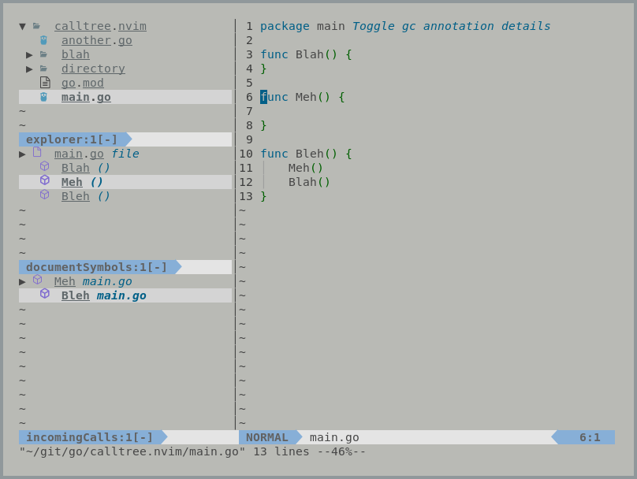

```
██╗     ██╗████████╗███████╗███████╗   ███╗   ██╗██╗   ██╗██╗███╗   ███╗
██║     ██║╚══██╔══╝██╔════╝██╔════╝   ████╗  ██║██║   ██║██║████╗ ████║ Lightweight
██║     ██║   ██║   █████╗  █████╗     ██╔██╗ ██║██║   ██║██║██╔████╔██║ Integrated
██║     ██║   ██║   ██╔══╝  ██╔══╝     ██║╚██╗██║╚██╗ ██╔╝██║██║╚██╔╝██║ Text
███████╗██║   ██║   ███████╗███████╗██╗██║ ╚████║ ╚████╔╝ ██║██║ ╚═╝ ██║ Editing
╚══════╝╚═╝   ╚═╝   ╚══════╝╚══════╝╚═╝╚═╝  ╚═══╝  ╚═══╝  ╚═╝╚═╝     ╚═╝ Environment
====================================================================================
```



# LITEE.nvim

LITEE.nvim (pronounced lite) provides an "IDE-lite" experience for Neovim. 

LITEE implements several missing features seen in other popular IDEs such as VSCode
and JetBrain IDEs while keeping a "native-vim" feel. 

LITEE is an acronym standing for "Lightweight Integrated Text Editing Environment".

Dubbed so to emphasize the goal of LITEE, implement some loved IDE features while
keeping the lightweight text editing experience of Neovim.

The currently implemented features are:

#### Calltree
Analogous to VSCode's "Call Hierarchy" tool, this feature exposes an explorable tree
of incoming or outgoing calls for a given symbol. 

Unlike other Neovim plugins, the tree can be expanded and collapsed to discover 
"callers-of-callers" and "callees-of-callees" until you hit a leaf.

#### Symboltree
Analogous to VSCode's "Outline" tool, this feature exposes a live tree of document
symbols for the current file. 

The tree is updated as you move around and change files.

#### Filetree
Analogous to VSCode's "Explorer", this feature exposes a full feature file explorer 
which supports recursive copies, recursive moves, and proper renaming of a file 
(more on this in `h: litee.nvim`).

# Usage

## Get it

Plug:
```
 Plug 'ldelossa/litee.nvim'
```

## Set it

Call the setup function from anywhere you configure your plugins from.

Configuration dictionary is explained in ./doc/litee.txt (:h litee-config)

```
require('litee').setup({})
```

## Use it

LITEE.nvim hooks directly into the LSP infrastructure by hijacking the necessary
handlers like so:

    vim.lsp.handlers['callHierarchy/incomingCalls'] = vim.lsp.with(
                require('litee.lsp.handlers').ch_lsp_handler("from"), {}
    )
    vim.lsp.handlers['callHierarchy/outgoingCalls'] = vim.lsp.with(
                require('litee.lsp.handlers').ch_lsp_handler("to"), {}
    )
    vim.lsp.handlers['textDocument/documentSymbol'] = vim.lsp.with(
                require('litee.lsp.handlers').ws_lsp_handler(), {}
    )

This occurs when `require('litee').setup()` is called.

Once the handlers are in place issuing the normal "vim.lsp.buf.incoming_calls", 
"vim.lsp.buf.outgoing_calls", and "vim.lsp.buf.document_symbol" functions will open 
the Calltree and Symboltree UI, respectively.

The Filetree can be opened with the command "LTOpenFiletree"

All of LITEE.nvim can be controlled via commands making it possible to navigate
the Calltree, Symboltree, and Filetree via key bindings. 

Check out the help file for full details.
